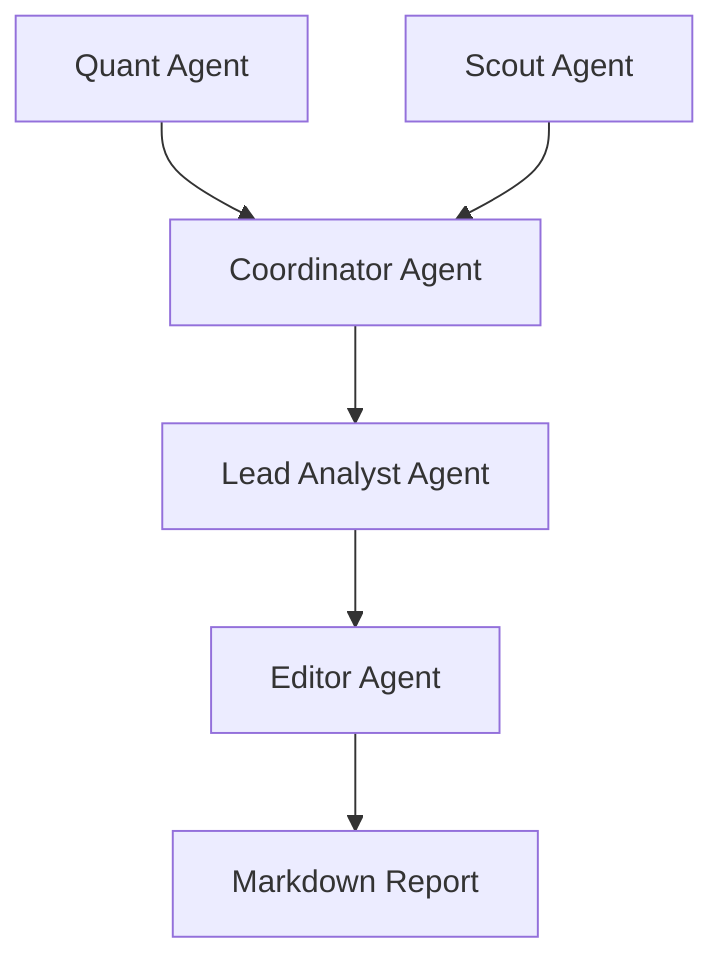

# Antigravity Microanalyst Team

A multi-agent autonomous system for cryptocurrency market analysis, built with PydanticAI and OpenRouter.

## Overview

The Antigravity Microanalyst Team is a specialized swarm of AI agents designed to perform high-fidelity technical and fundamental analysis on crypto assets. The system employs a modular architecture with explicit dependency injection, production-grade resilience, and a strict logic matrix for strategy synthesis.

## Core Agents

- **Quant Agent**: Performs technical analysis, calculates indicators (EMA, RSI), and identifies market regimes.
- **Scout Agent**: Gathers macro context and real on-chain data from multiple free blockchain data sources (DeFiLlama, CoinGecko, Dune Analytics).
- **Blockchain Agent**: Specialized agent for comprehensive on-chain analysis using multi-source orchestration.
- **Coordinator Agent**: Aggregates data from Quant and Scout agents into a unified Master State.
- **Lead Analyst Agent**: Synthesizes the Master State using a strict Logic Matrix to produce trading directives.
- **Editor Agent**: Transforms technical directives into polished, human-readable executive summaries.

## Architecture



## Setup

### Prerequisites

- Python 3.10+
- OpenRouter API Key

### Installation

1. **Clone the repository**:

   ```bash
   git clone <repository-url>
   cd antigravity-microanalyst-team
   ```

2. **Install dependencies**:

   ```bash
   pip install -r requirements.txt
   ```

   This includes:
   - `pydantic-ai` for agent framework
   - `aiohttp` for async blockchain API calls
   - `tenacity` for retry logic and resilience
   - `yfinance` for market data
   - `pandas`, `matplotlib`, `seaborn` for analytics

3. **Configure Environment Variables**:

   Create a `.env` file in the root directory:

   ```bash
   cp .env.example .env
   ```

   **Required**:
   ```env
   OPENROUTER_API_KEY=your_sk_key_here
   ```

   **Optional** (for enhanced blockchain data access):
   ```env
   # Dune Analytics (1000 queries/day free) - Get key at https://dune.com
   DUNE_API_KEY=your_dune_key

   # Etherscan (100K calls/day free) - Get key at https://etherscan.io/apis
   ETHERSCAN_API_KEY=your_etherscan_key

   # Other blockchain explorers (all free tier)
   BSCSCAN_API_KEY=your_bsc_key
   POLYGONSCAN_API_KEY=your_polygon_key
   ```

   **Note**: DeFiLlama and CoinGecko work without API keys!

## Usage

### Run the full pipeline

To run the complete analysis flow (from data fetching to report generation):

```bash
python -m agents.editor_agent
```

### Run individual agents

**Quant Agent** (Technical Analysis):
```bash
python -m agents.quant_agent BTC-USD
```

**Scout Agent** (Fundamental + On-Chain Analysis):
```bash
python -m agents.scout_agent
```

**Blockchain Agent** (Comprehensive On-Chain Analysis):
```bash
python -m agents.blockchain_agent
```

**Coordinator Agent** (Aggregate Market State):
```bash
python -m agents.coordinator_agent
```

**Lead Analyst Agent** (Strategy Synthesis):
```bash
python -m agents.analyst_agent
```

### Test blockchain data sources

Test the new on-chain data adapters:

```bash
# Test all adapters (DeFiLlama, CoinGecko, etc.)
python -m tools.blockchain_adapters

# Test multi-source orchestrator
python -m tools.blockchain_orchestrator
```

### Quick Examples

**Get DeFi protocol TVL**:
```python
from tools.blockchain_orchestrator import MultiSourceOrchestrator, get_protocol_tvl
import asyncio

async def main():
    orchestrator = MultiSourceOrchestrator()
    tvl = await get_protocol_tvl(orchestrator, 'aave')
    print(f"Aave TVL: ${tvl['data']['tvl']:,.0f}")

asyncio.run(main())
```

**Get crypto prices**:
```python
from tools.blockchain_orchestrator import get_token_price
import asyncio

async def main():
    orchestrator = MultiSourceOrchestrator()
    prices = await get_token_price(orchestrator, ['bitcoin', 'ethereum'])
    print(prices['data'])

asyncio.run(main())
```

## On-Chain Data Sources

The system includes **enterprise-grade blockchain data access at zero cost** using multiple free APIs instead of expensive premium services ($500+/month).

### Available Data Sources

| Source | Coverage | Rate Limit | API Key Required |
|--------|----------|------------|------------------|
| **DeFiLlama** | TVL, protocols, chains | Unlimited | No ✅ |
| **CoinGecko** | Prices, market data | 50 calls/min | No ✅ |
| **Dune Analytics** | Complex queries | 1000/day | Yes (free) |
| **Etherscan Family** | Transactions, balances | 100K/day | Yes (free) |

**Total Daily Capacity**: 170K+ queries across all sources

### Key Features

✅ **Multi-source orchestration** with automatic fallback chains
✅ **Intelligent caching** (file-based, no Redis required)
✅ **Rate limit handling** with exponential backoff
✅ **Query complexity assessment** for optimal routing
✅ **Zero monthly cost** using free tiers
✅ **Production-ready** with comprehensive error handling

### Performance

- **Throughput**: 170K+ queries/day (free tiers)
- **Latency**: 200ms-2s (cache hits: <10ms)
- **Reliability**: 4 data sources with automatic failover
- **Cost**: $0/month vs. $500+/month for premium services

### What You Get

- Real-time DeFi protocol TVL and metrics
- Token prices and market capitalization
- Stablecoin supply trends (liquidity indicator)
- Blockchain ecosystem health metrics
- Historical analytics via Dune queries
- Transaction history and wallet analysis

See [ONCHAIN_DATA_SOURCES.md](./ONCHAIN_DATA_SOURCES.md) for complete documentation, usage examples, and troubleshooting.

## Documentation

- **Agents**: Detailed in [AGENTS.md](./AGENTS.md)
- **On-Chain Data**: Detailed in [ONCHAIN_DATA_SOURCES.md](./ONCHAIN_DATA_SOURCES.md)
- **API Documentation**: See [API_DOCUMENTATION.md](./API_DOCUMENTATION.md)
- **Inline Docs**: All modules follow Google-style docstrings

## Troubleshooting

### Common Issues

**"ModuleNotFoundError: No module named 'aiohttp'"**
```bash
pip install -r requirements.txt --upgrade
```

**Slow blockchain data queries**
- First run is always slower (builds cache)
- Subsequent runs use cached data (<10ms)
- Dune Analytics queries can take 5-30 seconds

**Rate limit errors**
- System automatically retries with exponential backoff
- Consider adding optional API keys to increase limits
- DeFiLlama and CoinGecko work without keys

**"API key not configured" warnings**
- These are optional - system works without them
- Add keys to `.env` only if you need higher rate limits
- See `.env.example` for all available keys

### Getting Help

1. Check [ONCHAIN_DATA_SOURCES.md](./ONCHAIN_DATA_SOURCES.md) for detailed troubleshooting
2. Review inline documentation in source files
3. Run test suites: `python -m tools.blockchain_adapters`
4. Open an issue on GitHub with error details

## Contributing

Contributions are welcome! Please:
1. Fork the repository
2. Create a feature branch
3. Add tests for new functionality
4. Submit a pull request

## License

MIT
