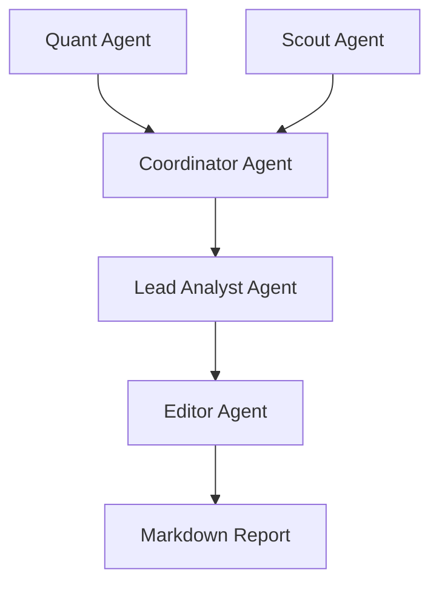

# Antigravity Microanalyst Team

A multi-agent autonomous system for cryptocurrency market analysis, built with PydanticAI and OpenRouter.

## Overview

The Antigravity Microanalyst Team is a specialized swarm of AI agents designed to perform high-fidelity technical and fundamental analysis on crypto assets. The system employs a modular architecture with explicit dependency injection, production-grade resilience, and a strict logic matrix for strategy synthesis.

### What's New

**Recent Enhancements** (December 2025):
- **Comprehensive On-Chain Data Integration**: Access real blockchain data from 4+ free sources without expensive subscriptions
- **Alternative Data Intelligence**: Capture market sentiment, social trends, and developer activity before they impact prices
- **Zero-Config Quick Start**: Core features work immediately with DeFiLlama and CoinGecko (no API keys required)
- **Multi-Source Orchestration**: Automatic fallback routing ensures analysis continues even when individual APIs fail
- **Intelligent Caching**: File-based caching reduces API calls and improves response times without external dependencies

## Core Agents

- **Quant Agent**: Performs technical analysis, calculates indicators (EMA, RSI), and identifies market regimes.
- **Scout Agent**: Gathers macro context and real on-chain data from multiple free blockchain data sources (DeFiLlama, CoinGecko, Dune Analytics). Enhanced with alternative data from news sentiment, social media, and market trends.
- **Blockchain Agent**: Specialized agent for comprehensive on-chain analysis using multi-source orchestration. Provides TVL tracking, protocol metrics, exchange flows, and whale wallet monitoring across multiple chains.
- **Coordinator Agent**: Aggregates data from Quant and Scout agents into a unified Master State.
- **Lead Analyst Agent**: Synthesizes the Master State using a strict Logic Matrix to produce trading directives.
- **Editor Agent**: Transforms technical directives into polished, human-readable executive summaries.

## Architecture



## Setup

### Prerequisites

- Python 3.10+
- OpenRouter API Key

### Installation

1. **Clone the repository**:

   ```bash
   git clone <repository-url>
   cd antigravity-microanalyst-team
   ```

2. **Install dependencies**:

   ```bash
   pip install -r requirements.txt
   ```

3. **Configure environment Variables**:
   Create a `.env` file in the root directory:

   ```env
   OPENROUTER_API_KEY=your_sk_key_here
   ```

## Usage

### Run the full pipeline

To run the complete analysis flow (from data fetching to report generation):

```bash
python -m agents.editor_agent
```

### Run individual agents for targeted analysis

**Technical Analysis**:
```bash
python -m agents.quant_agent BTC-USD
```

**On-Chain Analysis** (uses DeFiLlama, CoinGecko - no API keys needed):
```bash
python -m agents.blockchain_agent
```

**Scout Analysis** (includes news sentiment, social media, trends):
```bash
python -m agents.scout_agent BTC
```

### Quick Examples

**Test On-Chain Data Integration**:
```bash
# Works immediately without any API keys!
python -m tools.blockchain_adapters
```

**Test Alternative Data Sources**:
```bash
# Fetch news sentiment, Reddit trends, Google search interest
python -m tools.alternative_data_adapters
```

**Run Multi-Source Orchestrator**:
```bash
# Demonstrates automatic fallback and intelligent routing
python -m tools.blockchain_orchestrator
```

## Data Sources

### On-Chain Data Sources

Access real blockchain data without expensive subscriptions:

| Data Source | Best For | Free Tier Limits | API Key Required |
|------------|----------|------------------|------------------|
| **DeFiLlama** | Protocol TVL, DeFi metrics, stablecoin dominance | Unlimited | ❌ No |
| **CoinGecko** | Token prices, market cap, volume, exchange data | 50 calls/min | ❌ No |
| **Dune Analytics** | Custom SQL queries, complex on-chain analytics | 1000 queries/day | ✅ Optional |
| **Etherscan Family** | Transaction history, wallet balances, smart contract calls | 100K calls/day | ✅ Optional |

**Key Capabilities**:
- **TVL Tracking**: Monitor protocol health via Total Value Locked changes (DeFiLlama)
- **Whale Monitoring**: Track large wallet movements and exchange flows (Etherscan)
- **Market Structure**: Real-time price and volume across exchanges (CoinGecko)
- **Custom Analytics**: Run complex blockchain queries for unique insights (Dune)
- **Multi-Chain Support**: Ethereum, BSC, Polygon, Arbitrum, and 20+ chains

**Zero-Setup Quick Start**: DeFiLlama and CoinGecko work immediately without configuration!

See [ONCHAIN_DATA_SOURCES.md](./ONCHAIN_DATA_SOURCES.md) for complete documentation and code examples.

### Alternative Data Sources

The system integrates non-traditional data sources for edge in analysis:

| Data Source | Provider | Insights Provided | Free Tier |
|------------|----------|-------------------|-----------|
| **News Sentiment** | CryptoPanic | Breaking news impact, sentiment shifts (-100 to +100), community validation | ✅ Yes |
| **Social Media** | Reddit | Community conviction via r/cryptocurrency, r/bitcoin engagement metrics | ✅ Yes |
| **Search Interest** | Google Trends | Retail attention correlation, trend momentum, early FOMO detection | ✅ Yes |
| **Developer Activity** | GitHub | Commit frequency, contributor growth, development health for fundamental analysis | ✅ Yes |
| **Options Market** | Deribit | Put/call ratios, implied volatility, smart money positioning | ✅ Yes |

**Real-World Use Cases**:
- **Sentiment Divergence**: Detect when negative news sentiment diverges from price action (potential reversal signal)
- **Social Momentum**: Track Reddit engagement spikes that often precede major moves
- **Retail FOMO Detection**: Google Trends spikes at market tops provide exit signals
- **Fundamental Validation**: GitHub activity decline warns of weakening project fundamentals
- **Smart Money Positioning**: Options flow reveals institutional positioning before retail

**Technical Features**:
- Multi-source orchestration with automatic fallback
- Intelligent caching (file-based, no Redis required)
- Rate limit handling with exponential backoff
- Query complexity assessment for optimal routing

See [ALTERNATIVE_DATA_SOURCES.md](./ALTERNATIVE_DATA_SOURCES.md) for complete documentation and code examples.

## Documentation

- **Agents**: Detailed in [AGENTS.md](./AGENTS.md)
- **On-Chain Data**: Detailed in [ONCHAIN_DATA_SOURCES.md](./ONCHAIN_DATA_SOURCES.md)
- **Alternative Data**: Detailed in [ALTERNATIVE_DATA_SOURCES.md](./ALTERNATIVE_DATA_SOURCES.md)
- **Feature Roadmap**: See [FEATURE_BRAINSTORM.md](./FEATURE_BRAINSTORM.md)
- **Inline Docs**: All modules follow Google-style docstrings.

## License

MIT
