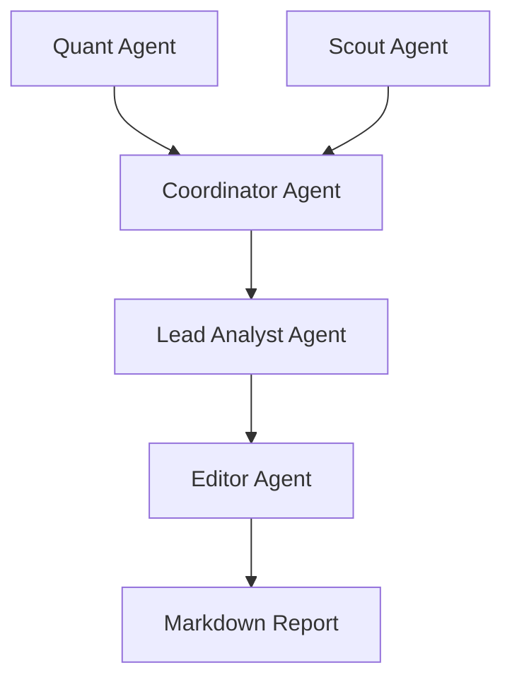

# Antigravity Microanalyst Team

A multi-agent autonomous system for cryptocurrency market analysis, built with PydanticAI and OpenRouter.

## Overview

The Antigravity Microanalyst Team is a specialized swarm of AI agents designed to perform high-fidelity technical and fundamental analysis on crypto assets. The system employs a modular architecture with explicit dependency injection, production-grade resilience, and a strict logic matrix for strategy synthesis.

## Core Agents

- **Quant Agent**: Performs technical analysis, calculates indicators (EMA, RSI), and identifies market regimes.
- **Scout Agent**: Gathers macro context and real on-chain data from multiple free blockchain data sources (DeFiLlama, CoinGecko, Dune Analytics).
- **Blockchain Agent**: Specialized agent for comprehensive on-chain analysis using multi-source orchestration.
- **Coordinator Agent**: Aggregates data from Quant and Scout agents into a unified Master State.
- **Lead Analyst Agent**: Synthesizes the Master State using a strict Logic Matrix to produce trading directives.
- **Editor Agent**: Transforms technical directives into polished, human-readable executive summaries.

## Architecture



## Setup

### Prerequisites

- Python 3.10+
- OpenRouter API Key

### Installation

1. **Clone the repository**:

   ```bash
   git clone <repository-url>
   cd antigravity-microanalyst-team
   ```

2. **Install dependencies**:

   ```bash
   pip install -r requirements.txt
   ```

3. **Configure environment Variables**:
   Create a `.env` file in the root directory:

   ```env
   OPENROUTER_API_KEY=your_sk_key_here
   ```

## Usage

### Run the full pipeline

To run the complete analysis flow (from data fetching to report generation):

```bash
python -m agents.editor_agent
```

*(Note: Individual agents can be run for targeted analysis, e.g., `python -m agents.quant_agent BTC-USD`)*

## On-Chain Data Sources

The system now includes cost-effective on-chain data access through multiple free APIs:

- **DeFiLlama**: TVL and protocol metrics (completely free)
- **CoinGecko**: Token prices and market data (50 calls/min free)
- **Dune Analytics**: Complex SQL queries (1000/day free tier)
- **Etherscan Family**: Transaction data and balances (100K/day free)

**Features**:
- Multi-source orchestration with automatic fallback
- Intelligent caching (file-based, no Redis required)
- Rate limit handling with exponential backoff
- Query complexity assessment for optimal routing

See [ONCHAIN_DATA_SOURCES.md](./ONCHAIN_DATA_SOURCES.md) for complete documentation.

## Documentation

- **Agents**: Detailed in [AGENTS.md](./AGENTS.md)
- **On-Chain Data**: Detailed in [ONCHAIN_DATA_SOURCES.md](./ONCHAIN_DATA_SOURCES.md)
- **Inline Docs**: All modules follow Google-style docstrings.

## License

MIT
